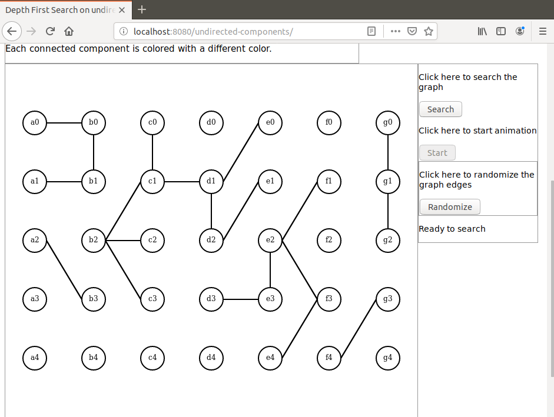
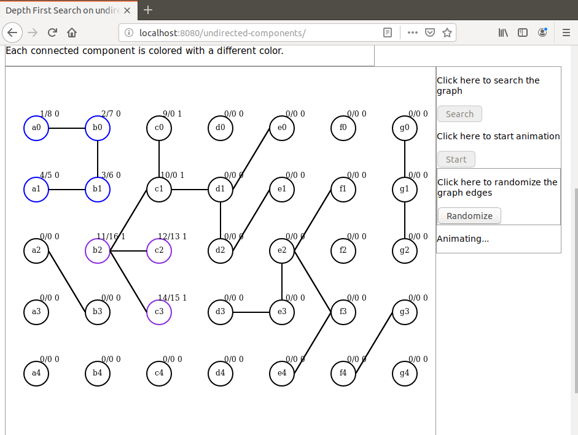
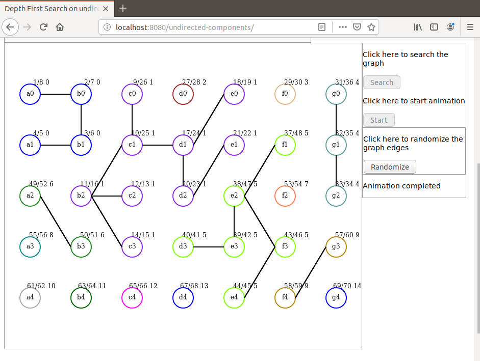

# depth-first-search-undir-anim
Java based animated demonstration of Depth First Search algorithm applied to find the connected components of an undirected graph.

I present here an animated demonstration of the Depth First Search algorithm applied to an undirected graph.

An undirected graph is randomly initialized (browser side) and sent to server side as a JSON object.

Then a DFS algorithm is performed on the graph (server side) and all intermediate results are saved as a collection.

This collection is sent back to the browser as a JSON object.

The collection is then used for animation. All vertices are colored according to the comnponent they belong to.

# Launching the demo
To launch the demo run the command `mvn spring-boot:run` in project directory. When the application has started open a browser and hit URL `localhost:8080/undirected-components`.

Here are some screen shots that can be seen during the demo:

Initial graph:

Animation step:

Search completed showing all components:

For a video demo follow this link:

https://youtu.be/UfSjthuc_6c

Dominique Ubersfeld, Cachan, France
